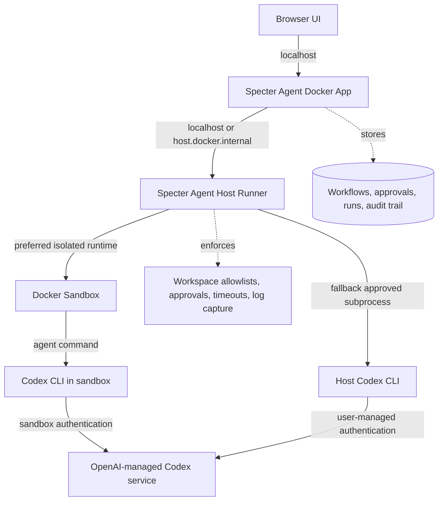

# Local Agent Runtime Architecture

Specter Agent uses local execution runtimes for software delivery agents.
Docker Sandboxes is the preferred isolation layer for agent work because it keeps
model-driven commands inside a disposable microVM while Specter records workflow
state, approvals, evidence, and audit events. A locally authenticated Codex CLI
host run remains available as a compatibility fallback.

## Runtime Boundary



```text
Browser UI
  |
  | localhost
  v
Specter Agent Docker App
  |  workflows, approvals, runs, audit trail
  |
  | localhost / host.docker.internal
  v
Specter Agent Host Runner
  |  workspace allowlists, command approvals, log capture
  |
  | preferred
  v
Docker Sandbox
  |  disposable microVM, mounted approved workspace
  v
Codex CLI in sandbox
  |  sandbox-scoped Codex authentication
  v
OpenAI-managed Codex service

Fallback path:
Specter Agent Host Runner
  |
  | subprocess
  v
Host Codex CLI
  |  user's local Codex login or API-key authentication
  v
OpenAI-managed Codex service
```

## Responsibilities

| Component | Responsibility |
|---|---|
| Browser UI | Presents runtime status, install guidance, approvals, run output, and captured artifacts. |
| Docker app | Stores Specter Agent data and calls the host runner through a local-only interface. |
| Host runner | Owns host checks, Docker Sandbox and Codex CLI detection, approved install guidance, subprocess execution, and filesystem guardrails. |
| Docker Sandbox | Runs agent commands inside an isolated disposable environment with only approved workspace access. |
| Codex CLI | Uses the user's Codex authentication and performs local coding-agent work. |
| OpenAI-managed Codex service | Handles Codex model execution and plan entitlements outside Specter Agent. |

## Connection Flow

1. Specter Agent asks the host runner for Docker Sandbox and Codex CLI status.
2. Host runner checks whether `sbx` is available on the host PATH.
3. If missing, Specter Agent shows Docker Sandbox install guidance for the host OS.
4. Specter Agent prompts the user to configure Codex authentication for sandboxed runs.
5. Host runner re-checks readiness and returns the preferred runtime state.
6. If Docker Sandbox is unavailable, Specter can fall back to the host Codex CLI runtime.
7. Workflow agents can request runtime work through approved workspaces only.

## Docker Sandbox Setup

Run the Specter prerequisite checker before local app startup:

```bash
python3 scripts/check_prerequisites.py
```

Use strict mode when sandboxed Codex execution is required immediately:

```bash
python3 scripts/check_prerequisites.py --strict
```

Use JSON output for installer or web-app consumption:

```bash
python3 scripts/check_prerequisites.py --json
```

Install Docker Sandboxes on the host:

```bash
brew install docker/tap/sbx
```

On Windows:

```powershell
winget install Docker.sbx
```

Then configure Codex authentication for sandboxed runs:

```bash
sbx secret set -g openai --oauth
```

The first implementation slice exposes `sbx` discovery and status in Specter.
Sandbox-backed execution will be wired in a later slice with explicit approval
gates, log streaming, workspace mounts, and artifact capture.

## Host Runner Versioning

The host runner exposes its version via:

```bash
python3 scripts/specter_host_runner.py --version
```

And via the HTTP route `GET /version` (proxied through the backend at
`/api/runtime-adapters/host-runner/version`). The Models page displays the
running version next to the Auto-start service status indicator.

## Auto-Start Service (launchd)

The host runner can register itself as a macOS launchd service so it starts
automatically on login and restarts on crash. Run once from the repo directory:

```bash
python3 scripts/specter_host_runner.py --install-service
```

This generates a plist pointing directly to `python3 + specter_host_runner.py`
(no shell script wrapper — avoids macOS Gatekeeper prompts), writes it to
`~/Library/LaunchAgents/com.specter-agent.host-runner.plist`, and loads it
immediately via `launchctl load -w`.

Key launchd properties:
- `KeepAlive: true` — auto-restarts on crash or kill
- `RunAtLoad: true` — starts on every login
- `ThrottleInterval: 5` — prevents tight restart loops on repeated failures
- Logs to `/tmp/specter-host-runner.log`

After the initial install, future code updates only require `git pull` — no
reinstall needed. The plist path resolves at install time from the running
script's location.

To uninstall:

```bash
launchctl unload -w ~/Library/LaunchAgents/com.specter-agent.host-runner.plist
rm ~/Library/LaunchAgents/com.specter-agent.host-runner.plist
```

The Models page also exposes Restart and Uninstall controls once the service
is running, requiring no terminal interaction for day-to-day management.

## Install And Upgrade Flow

The host runner can execute the official Codex CLI installer only when started
with explicit maintenance mode enabled:

```bash
SPECTER_HOST_RUNNER_ENABLE_INSTALL=1 python3 scripts/specter_host_runner.py
```

Specter Agent uses the same installer path for install and upgrade. The web app
can show the detected local version and, when package metadata is reachable,
the latest known version. If the latest-version lookup is unavailable, upgrade
remains an explicit user-approved action rather than a background operation.

## Guardrails

- Do not mount or copy `~/.codex` into the Docker container.
- Do not store Codex access tokens, ChatGPT session credentials, or OpenAI API
  keys in Specter Agent runtime data.
- Bind the host runner to localhost only.
- Require an allowlisted workspace path before starting any Codex subprocess.
- Require explicit approval for install, external writes, destructive commands,
  publishing, and repository changes that cross the configured policy boundary.
- Capture command, workspace, start time, exit status, output summary, and
  produced artifacts for audit.
- Enforce subprocess timeouts, max iterations, output limits, and cancellation.

## Governed Read-Only Run Flow

The first execution slice supports read-only Codex runtime tests:

1. An admin approves a host workspace path in Specter Agent.
2. Specter Agent stores the approved workspace in SQLite.
3. A user submits a read-only prompt for an approved workspace.
4. The backend records a `runtime_runs` audit row with status `running`.
5. The backend calls the host runner with workspace path, prompt, mode, and
   timeout.
6. The host runner validates the path on the host and invokes:

```bash
codex exec --cd <workspace> --sandbox read-only --json <prompt>
```

7. The host runner captures stdout, stderr, exit code, and the final agent
   message.
8. The backend stores the result and exposes recent runs in the Models page.

Write-capable Codex tasks are intentionally out of scope for this slice. They
should require explicit approval gates, stronger run policies, cancellation,
and artifact review before being enabled.

## Repository Discovery

Workspace approval can start from an explicit user-provided root directory. The
host runner scans only under that root, with bounded depth and result limits,
then returns candidate Git repositories for user review.

Discovery guardrails:

- The user must provide the root path; Specter Agent does not scan the whole
  machine.
- The host runner rejects the user's home directory as a scan root.
- Discovery skips heavy or internal directories such as `.git`, `node_modules`,
  `.venv`, `dist`, `build`, `.next`, `target`, and `vendor`.
- Repositories are never auto-approved; the user selects which candidates become
  approved runtime workspaces.

## MCP Connector Architecture

The host runner manages MCP (Model Context Protocol) server configuration for
multiple AI agent clients through a pluggable adapter pattern.

### Adapter registry

```python
class McpClientAdapter:
    client_id: str        # e.g. "codex", "claude-code"
    display_name: str

    def list_configured(self) -> dict[str, Any]: ...  # live state from CLI
    def build_server_list(self) -> dict[str, Any]:    # merge catalog + live
    def add(self, payload) -> dict[str, Any]: ...
    def remove(self, name) -> dict[str, Any]: ...
    def login_instructions(self, name) -> dict[str, Any]: ...
```

Two adapters are registered:

| Adapter | `client_id` | Live source | Config written to |
|---|---|---|---|
| `CodexMcpAdapter` | `codex` | `codex mcp list --json` | Codex CLI config |
| `ClaudeCodeMcpAdapter` | `claude-code` | `claude mcp list` (text) | `~/.claude/settings.json` |

Adding support for a new client (e.g. Cursor, Kiro) requires only a new
`McpClientAdapter` subclass — no frontend changes needed.

### Binary path resolution

The host runner runs as a launchd service with a minimal PATH. Each adapter
resolves its CLI binary with explicit fallback paths:

- `ClaudeCodeMcpAdapter._claude_exe()` checks `shutil.which("claude")` then
  `/opt/homebrew/bin/claude`, `~/.npm-global/bin/claude`, etc.
- `CodexMcpAdapter` delegates to `codex_candidate_paths()` which already
  includes `/opt/homebrew/bin/codex` and `~/.local/bin/codex`.

### MCP catalog

`MCP_CATALOG` is a list of known MCP server entries. Each entry may include a
`"clients"` field to scope it to specific adapters:

```python
{ "id": "claude-ai-gmail", "name": "claude.ai Gmail", ..., "clients": ["claude-code"] }
```

Entries without `"clients"` appear for all adapters. Claude Code-only entries
(Gmail, Google Drive, Google Calendar, Canva, Gamma, Atlassian Rovo, Microsoft
Learn, GoDaddy, KRISP) are scoped this way.

### URL-based matching

Claude Code renames catalog servers (e.g. catalog `"figma"` → live `"claude.ai
Figma"`). `build_server_list()` falls back to URL comparison when the name
doesn't match, using the catalog entry's `url` field against the live
server's transport URL.

### HTTP routes

All `/mcp/*` routes accept a `?client=` query parameter:

| Route | Method | Description |
|---|---|---|
| `/mcp/list?client=` | GET | Returns merged catalog + live state |
| `/mcp/add?client=` | POST | Adds a server to the client's config |
| `/mcp/remove/<name>?client=` | POST | Removes a server |
| `/mcp/login/<name>?client=` | GET | Returns login/auth instructions |

The backend proxies these at `/api/runtime-adapters/mcp/*`, forwarding the
`client` query param through to the host runner.

---

## Product Positioning

Codex CLI Runtime is not a raw model provider. It is a local execution runtime
for software engineering agents. OpenAI API providers remain separate and should
use API-platform credentials when direct model calls are needed.
