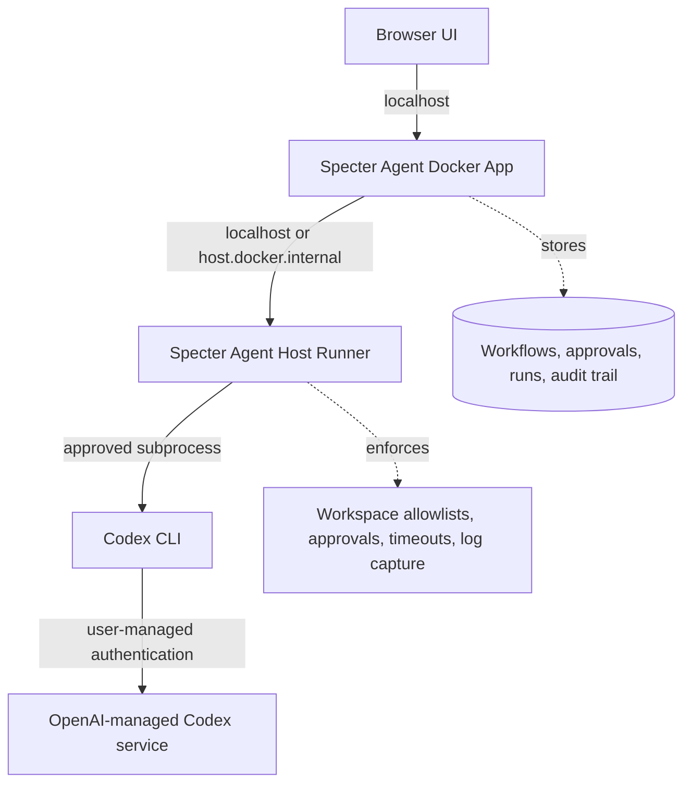

# Codex CLI Host Runner Architecture

Specter Agent can use a locally authenticated Codex CLI as an execution runtime
for software delivery agents. This keeps OpenAI-managed Codex credentials on the
user's machine while Specter Agent records workflow state, approvals, evidence,
and audit events.

## Runtime Boundary



```text
Browser UI
  |
  | localhost
  v
Specter Agent Docker App
  |  workflows, approvals, runs, audit trail
  |
  | localhost / host.docker.internal
  v
Specter Agent Host Runner
  |  workspace allowlists, command approvals, log capture
  |
  | subprocess
  v
Codex CLI
  |  user's local Codex login or API-key authentication
  v
OpenAI-managed Codex service
```

## Responsibilities

| Component | Responsibility |
|---|---|
| Browser UI | Presents runtime status, install guidance, approvals, run output, and captured artifacts. |
| Docker app | Stores Specter Agent data and calls the host runner through a local-only interface. |
| Host runner | Owns host checks, Codex CLI detection, approved install, subprocess execution, and filesystem guardrails. |
| Codex CLI | Uses the user's existing Codex authentication and performs local coding-agent work. |
| OpenAI-managed Codex service | Handles Codex model execution and plan entitlements outside Specter Agent. |

## Connection Flow

1. Specter Agent asks the host runner for Codex CLI status.
2. Host runner checks whether `codex` is available on the host PATH.
3. If missing, Specter Agent shows an approved install action.
4. After approval, the host runner runs the official Codex CLI installer.
5. Specter Agent prompts the user to run or complete `codex` sign-in on the host.
6. Host runner re-checks readiness and returns the connected runtime state.
7. Workflow agents can request Codex CLI runs through approved workspaces only.

## Install And Upgrade Flow

The host runner can execute the official Codex CLI installer only when started
with explicit maintenance mode enabled:

```bash
SPECTER_HOST_RUNNER_ENABLE_INSTALL=1 python3 scripts/specter_host_runner.py
```

Specter Agent uses the same installer path for install and upgrade. The web app
can show the detected local version and, when package metadata is reachable,
the latest known version. If the latest-version lookup is unavailable, upgrade
remains an explicit user-approved action rather than a background operation.

## Guardrails

- Do not mount or copy `~/.codex` into the Docker container.
- Do not store Codex access tokens, ChatGPT session credentials, or OpenAI API
  keys in Specter Agent runtime data.
- Bind the host runner to localhost only.
- Require an allowlisted workspace path before starting any Codex subprocess.
- Require explicit approval for install, external writes, destructive commands,
  publishing, and repository changes that cross the configured policy boundary.
- Capture command, workspace, start time, exit status, output summary, and
  produced artifacts for audit.
- Enforce subprocess timeouts, max iterations, output limits, and cancellation.

## Governed Read-Only Run Flow

The first execution slice supports read-only Codex runtime tests:

1. An admin approves a host workspace path in Specter Agent.
2. Specter Agent stores the approved workspace in SQLite.
3. A user submits a read-only prompt for an approved workspace.
4. The backend records a `runtime_runs` audit row with status `running`.
5. The backend calls the host runner with workspace path, prompt, mode, and
   timeout.
6. The host runner validates the path on the host and invokes:

```bash
codex exec --cd <workspace> --sandbox read-only --json <prompt>
```

7. The host runner captures stdout, stderr, exit code, and the final agent
   message.
8. The backend stores the result and exposes recent runs in the Models page.

Write-capable Codex tasks are intentionally out of scope for this slice. They
should require explicit approval gates, stronger run policies, cancellation,
and artifact review before being enabled.

## Repository Discovery

Workspace approval can start from an explicit user-provided root directory. The
host runner scans only under that root, with bounded depth and result limits,
then returns candidate Git repositories for user review.

Discovery guardrails:

- The user must provide the root path; Specter Agent does not scan the whole
  machine.
- The host runner rejects the user's home directory as a scan root.
- Discovery skips heavy or internal directories such as `.git`, `node_modules`,
  `.venv`, `dist`, `build`, `.next`, `target`, and `vendor`.
- Repositories are never auto-approved; the user selects which candidates become
  approved runtime workspaces.

## Product Positioning

Codex CLI Runtime is not a raw model provider. It is a local execution runtime
for software engineering agents. OpenAI API providers remain separate and should
use API-platform credentials when direct model calls are needed.
