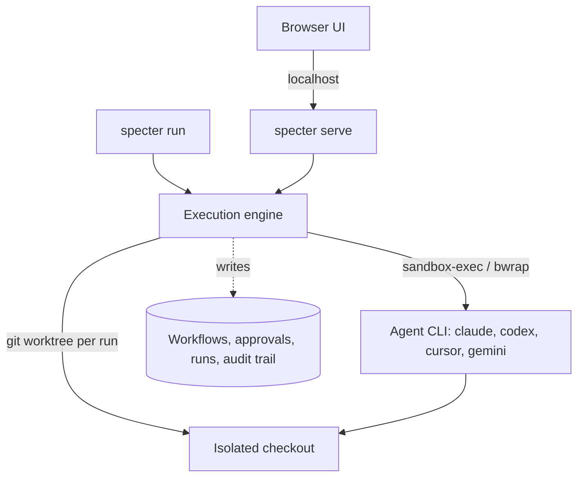

# Local Agent Runtime

Specter runs coding agents on your machine, with your own CLIs and your own
credentials. This page describes how a workflow node reaches an agent, and what
stands between that agent and the rest of your filesystem.

:::info The host runner is gone

Earlier versions ran a **separate Python process** on `localhost:8765`. The
containerized backend had no agent binary and no credentials, so it posted to
that process over HTTP and the process spawned the agent.

`specter serve` spawns agents itself. There is no second process to start, no
port to bind, and no bridge to keep alive — which removes an entire class of
failure where the app was running and the runner was not. The URL of this page
is unchanged so existing links still resolve.

:::

## How a node reaches an agent



`specter serve` and `specter run` are the same binary with different entry
points, so a run started from the terminal and a run started from the browser
execute identical code. Both write to one database, which is why a CLI-started
run appears in the web UI without the two processes ever talking to each other.

## What runs where

| Component | Responsibility |
|---|---|
| Browser UI | Runtime status, approvals, run output, captured artifacts. |
| `specter serve` | Serves the API and the web UI, and executes workflow runs. |
| `specter run` | Executes a workflow in your terminal. No server needed. |
| Execution engine | Agent detection, workspace allowlist, subprocess spawn, streaming, timeouts, cancellation. |
| Agent CLI | Your own install, with your own credentials. Never bundled. |

## Agent CLIs are detected, never installed

Specter does not install agent CLIs and does not hold their credentials. Run:

```bash
specter status
```

It reports which of `claude`, `codex`, `cursor` and `gemini` are on this
machine, whether `git` and `gh` are present and what each one enables, which
confinement mechanism is active, and which repositories are approved.

Detection deliberately searches more than `PATH`. Under launchd, `PATH` is
`/usr/bin:/bin:/usr/sbin:/sbin` and every Homebrew-installed agent is invisible,
so the usual install roots are searched as well.

## Confinement

An agent runs inside an OS-level sandbox — `sandbox-exec` on macOS,
`bwrap` on Linux — that denies writes outside the run's worktree and denies
reads of `~/.ssh`, `~/.aws`, `~/.gnupg` and `~/.kube` entirely.

This is defence in depth, and the layering matters. Each agent CLI has its own
permission flag (`--permission-mode plan`, `--sandbox read-only`), but those are
**advisory** — an agent can shell out past its own flag. The OS boundary cannot
be shelled past.

Where no mechanism is available, the run reports `mechanism: none` rather than
claiming confinement it does not have. An unconfined run that reads as confined
is worse than one that admits it. To refuse instead of warning:

```bash
SPECTER_REQUIRE_CONFINEMENT=1 specter run <workflow>
```

## A worktree per run

Each run gets its own `git worktree`, not the repository you are working in. A
bad run costs a discarded directory rather than your uncommitted work.

A worktree rather than a copy because it is nearly free — git shares the object
store — and because it produces a real branch. That branch is what lets a
read-write run arrive as a pull request instead of as edits already applied to
your tree. Read-only runs detach at `HEAD`; a non-git directory falls back to a
copy and says so in the run metadata rather than behaving differently in silence.

Worktrees live under `~/.specter/runs/`. A failed run keeps its checkout so the
failure can be inspected.

## Approved workspaces

A run against a path that is not on the allowlist is refused **before any agent
is spawned**. Add repositories on the Connectors / Workspaces page in the web UI.

A missing allowlist rejects rather than allowing everything — a missing config is
not consent.

## Docker Sandbox

Docker Sandboxes (`sbx`) remain available as an additional isolation layer for
agent work, keeping model-driven commands inside a disposable microVM. See
[Docker Sandbox](./docker-sandbox.md) for setup.

## Auto-start on login (macOS)

The service supervises `specter serve` — the server itself, since there is no
longer a separate runner to keep alive. Install it from the Models page, or:

```bash
launchctl load -w ~/Library/LaunchAgents/com.specter.agent.plist
```

Key properties: `KeepAlive` restarts on crash, `RunAtLoad` starts on login,
`ThrottleInterval` prevents tight restart loops. Logs go to
`/tmp/specter-agent.log`.

The Models page exposes Install, Restart and Remove, so day-to-day management
needs no terminal.

## Guardrails

These hold regardless of which agent runs:

- Require an allowlisted workspace before spawning any agent.
- Never mount or copy an agent's credential directory (`~/.codex`, `~/.claude`)
  into a container.
- Never store agent access tokens or API keys in Specter's runtime data.
- Require explicit approval for external writes, destructive commands,
  publishing, and repository changes that cross the configured policy boundary.
- Capture command, workspace, start time, exit status, output summary and
  produced artifacts for audit.
- Enforce subprocess timeouts, output limits and cancellation. Cancelling a
  running node kills the subprocess rather than orphaning it.
